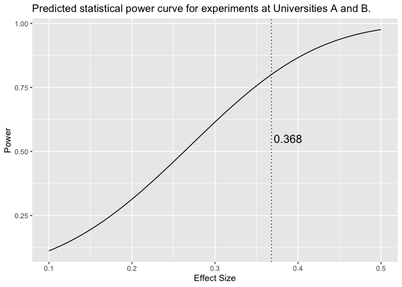
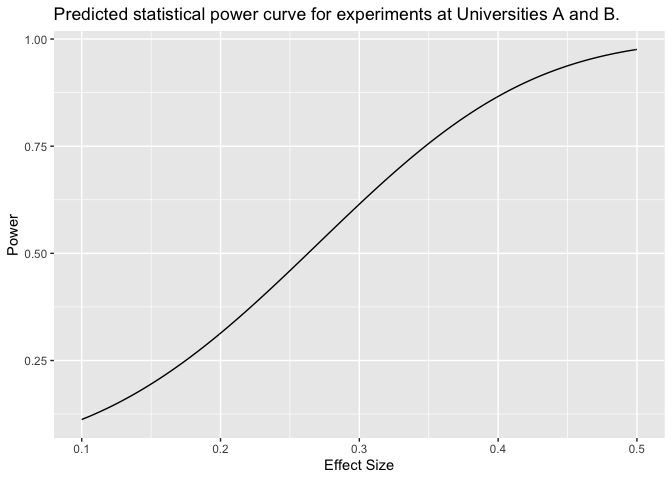
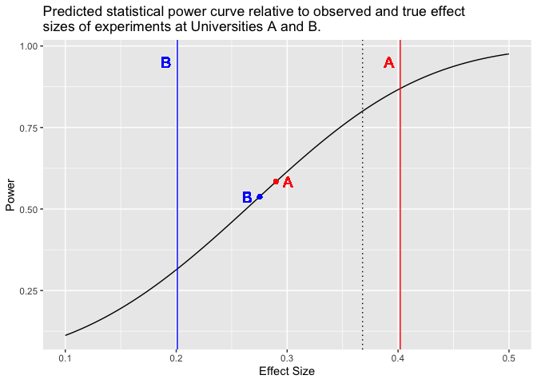

Code Repository for Post Hoc Power Simulation
================
Lacey W. Heinsberg and Daniel E. Weeks

Copyright information
=====================

Copyright 2022, University of Pittsburgh. All Rights Reserved. License: GPL-2 (<https://www.gnu.org/licenses/old-licenses/gpl-2.0.en.html>)

Repository description
======================

This repository contains R markdown analysis code that accompanies our paper "Post hoc Power is Not Informative" (https://onlinelibrary.wiley.com/doi/abs/10.1002/gepi.22464).

Heinsberg, L. W., & Weeks, D. E. (2022). Post hoc power is not informative. Genetic epidemiology, 10.1002/gepi.22464. Advance online publication. https://doi.org/10.1002/gepi.22464

To support accessibility of this paper until the 12 month embargo has been lifted, a self-archived version of the submitted (i.e., pre-peer reviewed) manuscript has been added to this GitHub repository `PostHocPower_SelfArchive_Pre-Review.docx` in accordance with Wiley's self-archiving policy. 

The purpose of our commentary is to provide a heuristic explanation of why post hoc power should not be used. To illustrate our point, we provide a detailed simulation study of two essentially identical research experiments hypothetically conducted in parallel at two separate universities. The simulation demonstrates that post hoc power calculations are misleading and simply not informative for data interpretation.

The purpose of this repository is to more fully document the details of our simulation through annotated code.

The code is presented as a single R Markdown file: `PosthocPower_Simulation.Rmd`.

If you have any questions or comments, please contact Lacey W. Heinsberg (<law145@pitt.edu>) or Daniel E. Weeks (<weeks@pitt.edu>).

Dependencies
============

The code relies on R package dependencies listed within the "Load libraries" section of `PosthocPower_Simulation.Rmd` which are also listed below in this README file.

Execution
=========

R Studio can be used to execute the .Rmd code using the `Knit` function from the quick bar.

Alternatively, this code can be executed without RStudio relying on a standalone Pandoc installation. With Pandoc installed, `rmarkdown::render()` can be used to execute and knit the .Rmd code.

We have also included details of the analyses in this README file to support online viewing.

Load libraries
--------------

``` r
library(tidyverse)
library(tidylog)
library(broom)
library(pander)
library(powerMediation)
library(ggplot2)
library(grateful)  # Install via devtools - devtools::install_github('https://github.com/Pakillo/grateful')
```

Scenario
--------

Suppose two scientific groups, one at University A and one at University B, are serendipitously and simultaneously working on essentially identical research experiments, using genetically identical mice (n=100) being fed the same diet. The purpose of their experiments is to determine the association between a two-allele genetic marker G (minor allele frequency=0.5) and a quantitative trait Y. Both groups use simple linear regression (i.e., Y ~ G) and a significance threshold of 0.05.

### Simulation set up

1.  Number of mice: 100 mice measured for a quantitative trait Y
2.  Risk factor: a two-allele genetic marker, G, with a minor allele frequency of 0.5
3.  True Effect size: To be revealed later
4.  Significance threshold: 0.05
5.  Statistical Test: simple linear regression of the quantitative trait Y on the genetic marker G (i.e., Y ~ G)

``` r
# Number of mice
n <- 100
# Minor allele frequency
q <- 0.5
p <- 1 - q
# Significance threshold
T <- 0.05
# Number of replicates in our simulation
nreps <- 1000
set.seed(seed = 26392021)
```

### Predicted statistical power

The groups submit grant applications to obtain funding for their research. Within the applications are their power calculations estimating a power curve using an analytical approach, using the `power.SLR` function from the `powerMediation` R package.

``` r
# Hypothesized standard deviation of x (G) and y (Y)
sigma.x <- 0.74
sigma.y <- 1
# Significance level
alpha <- 0.05
# Range of potential effect sizes
beta <- seq(0.1, 0.5, by = 0.001)
# Create power table
power.table <- tibble(beta = beta, power = NA)
power.table$power <- as.numeric(power.table$power)
for (i in 1:length(beta)) {
    power.table[i, "beta"] <- beta[i]
    power.table[i, "power"] <- power.SLR(n = n, lambda.a = beta[i], sigma.x = sigma.x, 
        sigma.y = sigma.y, alpha = alpha, verbose = FALSE)$power
}
power.table
```

    ## # A tibble: 401 x 2
    ##     beta power
    ##    <dbl> <dbl>
    ##  1 0.1   0.112
    ##  2 0.101 0.114
    ##  3 0.102 0.115
    ##  4 0.103 0.116
    ##  5 0.104 0.118
    ##  6 0.105 0.119
    ##  7 0.106 0.120
    ##  8 0.107 0.122
    ##  9 0.108 0.123
    ## 10 0.109 0.125
    ## # … with 391 more rows

``` r
# Determine the minimum effect size that can be detected with the given study
# design
p.80 <- minEffect.SLR(n = n, power = 0.8, sigma.x = sigma.x, sigma.y = sigma.y, alpha = 0.05, 
    verbose = FALSE)$lambda.a
p.80 <- round(p.80, 3)
# Plot power curve
ggplot(data = power.table, aes(x = beta, y = power)) + geom_line() + xlab("Effect Size") + 
    ylab("Power") + geom_vline(xintercept = p.80, color = "black", linetype = "dotted") + 
    annotate("text", x = p.80 + 0.02, y = 0.55, label = p.80, size = 5) + ggtitle("Predicted statistical power curve for experiments at Universities A and B.")
```



*The above figure corresponds to Figure 1 in the manuscript. The black solid line represents analytically-derived estimates of predicted pre-study power as a function of assumed effect size while the black dotted line indicates the minimum effect size the study has 80% predicted power to detect.*

Based on these power calculations, if the standard deviation of the predictor G is assumed to be 0.74 and the marginal standard deviation of the outcome, the trait Y, is assumed to be 1, then by carrying out a two-sided simple linear regression test at the 0.05 significance level, regressing outcome Y on predictor G, the estimated power graph is created (using the `power.SLR` function from the `powerMediation` R package). The groups determine they have 80% predicted power to detect an effect size of 0.368 or greater.

The groups receive funding for their work (Woo hoo!) and carry out their experiments.

### Run simulation

The following code simulates 1000 possible observations at University A and 1000 possible observations at University B using true *a priori* effect sizes for each model (to be revealed later), genotype distributions simulated under Hardy-Weinberg equilirbium (HWE, see below), and an error term from a standard normal distribution to indicate uncertainty in the model (i.e., Y ~ True\_Effect\*G + E).

#### University A

``` r
# Define expected genotype distribution under HWE
f <- c(p * p, 2 * p * q, q * q)
# Simulate genotype data
G <- sample(c(0, 1, 2), size = n, replace = TRUE, prob = f)
# Genotype distribution
pander(addmargins(table(G)), "Distribution of genotypes at University A")
```

<table style="width:28%;">
<caption>Distribution of genotypes at University A</caption>
<colgroup>
<col width="6%" />
<col width="6%" />
<col width="6%" />
<col width="6%" />
</colgroup>
<thead>
<tr class="header">
<th align="center">0</th>
<th align="center">1</th>
<th align="center">2</th>
<th align="center">Sum</th>
</tr>
</thead>
<tbody>
<tr class="odd">
<td align="center">26</td>
<td align="center">45</td>
<td align="center">29</td>
<td align="center">100</td>
</tr>
</tbody>
</table>

``` r
# Set up table to store results of simulation
results <- tibble(i = seq(1, nreps), pval = NA, term = NA, estimate = NA, std.error = NA, 
    ci_low = NA, ci_high = NA, statistic = NA)
results$pval <- as.numeric(results$pval)
results$term <- as.character(results$term)
results$estimate <- as.numeric(results$estimate)
results$std.error <- as.numeric(results$std.error)
results$ci_low <- as.numeric(results$ci_low)
results$ci_high <- as.numeric(results$ci_high)
results$statistic <- as.numeric(results$statistic)

# Generate results across 1000 simulations
for (i in 1:nreps) {
    Y <- true_betaA * G + rnorm(n)
    mod <- lm(Y ~ G)
    results[i, "pval"] <- tidy(mod)[2, "p.value"]
    results[i, "term"] <- tidy(mod)[2, "term"]
    results[i, "estimate"] <- tidy(mod)[2, "estimate"]
    results[i, "std.error"] <- tidy(mod)[2, "std.error"]
    results[i, "ci_low"] <- tidy(mod, conf.int = 0.95)[2, "conf.low"]
    results[i, "ci_high"] <- tidy(mod, conf.int = 0.95)[2, "conf.high"]
    results[i, "statistic"] <- tidy(mod)[2, "statistic"]
}

# Calculate the simulation-derived 'true power' by dividing the number of
# significant results by total results (number of simulations)
true_powerA <- sum(results$pval < T)/sum(!is.na(results$pval))

# Let's say that the research group observed a p-value of about 0.052 Select this
# observation from the distribution of simulated results
p_approx <- 0.052
expA <- results %>% filter(pval <= p_approx & pval > p_approx - 0.001) %>% arrange(desc(pval)) %>% 
    head(1)
```

    ## filter: removed 997 rows (>99%), 3 rows remaining

``` r
pander(expA, "Results of experiment at University A")
```

<table>
<caption>Results of experiment at University A</caption>
<colgroup>
<col width="7%" />
<col width="12%" />
<col width="8%" />
<col width="13%" />
<col width="15%" />
<col width="15%" />
<col width="12%" />
<col width="13%" />
</colgroup>
<thead>
<tr class="header">
<th align="center">i</th>
<th align="center">pval</th>
<th align="center">term</th>
<th align="center">estimate</th>
<th align="center">std.error</th>
<th align="center">ci_low</th>
<th align="center">ci_high</th>
<th align="center">statistic</th>
</tr>
</thead>
<tbody>
<tr class="odd">
<td align="center">536</td>
<td align="center">0.05171</td>
<td align="center">G</td>
<td align="center">0.2899</td>
<td align="center">0.1472</td>
<td align="center">-0.002191</td>
<td align="center">0.582</td>
<td align="center">1.97</td>
</tr>
</tbody>
</table>

#### University B

``` r
# Repeat the steps taken above for University B
f <- c(p * p, 2 * p * q, q * q)
G <- sample(c(0, 1, 2), size = n, replace = TRUE, prob = f)
pander(addmargins(table(G)), "Distribution of genotypes at University B")
```

<table style="width:28%;">
<caption>Distribution of genotypes at University B</caption>
<colgroup>
<col width="6%" />
<col width="6%" />
<col width="6%" />
<col width="6%" />
</colgroup>
<thead>
<tr class="header">
<th align="center">0</th>
<th align="center">1</th>
<th align="center">2</th>
<th align="center">Sum</th>
</tr>
</thead>
<tbody>
<tr class="odd">
<td align="center">33</td>
<td align="center">45</td>
<td align="center">22</td>
<td align="center">100</td>
</tr>
</tbody>
</table>

``` r
results <- tibble(i = seq(1, nreps), pval = NA, term = NA, estimate = NA, std.error = NA, 
    ci_low = NA, ci_high = NA, statistic = NA)
results$pval <- as.numeric(results$pval)
results$term <- as.character(results$term)
results$estimate <- as.numeric(results$estimate)
results$std.error <- as.numeric(results$std.error)
results$ci_low <- as.numeric(results$ci_low)
results$ci_high <- as.numeric(results$ci_high)
results$statistic <- as.numeric(results$statistic)

for (i in 1:nreps) {
    Y <- true_betaB * G + rnorm(n)
    mod <- lm(Y ~ G)
    results[i, "pval"] <- tidy(mod)[2, "p.value"]
    results[i, "term"] <- tidy(mod)[2, "term"]
    results[i, "estimate"] <- tidy(mod)[2, "estimate"]
    results[i, "std.error"] <- tidy(mod)[2, "std.error"]
    results[i, "ci_low"] <- tidy(mod, conf.int = 0.95)[2, "conf.low"]
    results[i, "ci_high"] <- tidy(mod, conf.int = 0.95)[2, "conf.high"]
    results[i, "statistic"] <- tidy(mod)[2, "statistic"]
}
true_powerB <- sum(results$pval < T)/sum(!is.na(results$pval))

# Again, the researchers at University B observe a p-value of about 0.052
expB <- results %>% filter(pval <= p_approx & pval > p_approx - 0.001) %>% arrange(desc(pval)) %>% 
    head(1)
```

    ## filter: removed 999 rows (>99%), one row remaining

``` r
pander(expB, "Results of experiment at University B")
```

<table>
<caption>Results of experiment at University B</caption>
<colgroup>
<col width="7%" />
<col width="12%" />
<col width="8%" />
<col width="13%" />
<col width="15%" />
<col width="15%" />
<col width="12%" />
<col width="13%" />
</colgroup>
<thead>
<tr class="header">
<th align="center">i</th>
<th align="center">pval</th>
<th align="center">term</th>
<th align="center">estimate</th>
<th align="center">std.error</th>
<th align="center">ci_low</th>
<th align="center">ci_high</th>
<th align="center">statistic</th>
</tr>
</thead>
<tbody>
<tr class="odd">
<td align="center">545</td>
<td align="center">0.05194</td>
<td align="center">G</td>
<td align="center">0.2753</td>
<td align="center">0.1399</td>
<td align="center">-0.002354</td>
<td align="center">0.5529</td>
<td align="center">1.968</td>
</tr>
</tbody>
</table>

### Results of the experiments from Universities A and B

Two experiments have now been carried out at the two universities, and very similar results have been obtained, each with a p-value that is approximately 0.052. Each group writes up their results, and each of their reviewers requests a post hoc power estimate.

<table>
<caption>Results of simple linear regression examining the association between a two-allele genetic marker, G, and a quantitative trait, Y, for experiments at Universities A and B</caption>
<colgroup>
<col width="15%" />
<col width="11%" />
<col width="8%" />
<col width="12%" />
<col width="13%" />
<col width="13%" />
<col width="11%" />
<col width="12%" />
</colgroup>
<thead>
<tr class="header">
<th align="center">University</th>
<th align="center">pval</th>
<th align="center">term</th>
<th align="center">estimate</th>
<th align="center">std.error</th>
<th align="center">ci_low</th>
<th align="center">ci_high</th>
<th align="center">statistic</th>
</tr>
</thead>
<tbody>
<tr class="odd">
<td align="center">A</td>
<td align="center">0.05171</td>
<td align="center">G</td>
<td align="center">0.2899</td>
<td align="center">0.1472</td>
<td align="center">-0.002191</td>
<td align="center">0.582</td>
<td align="center">1.97</td>
</tr>
<tr class="even">
<td align="center">B</td>
<td align="center">0.05194</td>
<td align="center">G</td>
<td align="center">0.2753</td>
<td align="center">0.1399</td>
<td align="center">-0.002354</td>
<td align="center">0.5529</td>
<td align="center">1.968</td>
</tr>
</tbody>
</table>

*The above table corresponds to Table 1 in the manuscript.*

### A discussion of post hoc power

So how should the requested post hoc power calculations be performed?

To do such a power calculation, a true effect size would need to be assumed.

On what basis should the assumed true effect size be chosen?

It is not clear what to assume, so a power curve based on analytical formulas could be created (as was done as part of the grant application for funding).

As above, if it is assumed that the standard deviation of the predictor G is 0.74 and that the marginal standard deviation of the outcome, the trait Y, is 1, then a two-sided simple linear regression test at the 0.05 significance level, regressing outcome Y on predictor G, creates the estimated power graph (using the `power.SLR` function from the `powerMediation` R package).

If the true effect size is 0.35, then the estimated power would be 0.76.

``` r
# Redraw analytical power curve from above
ggplot(data = power.table, aes(x = beta, y = power)) + geom_line() + xlab("Effect Size") + 
    ylab("Power") + ggtitle("Predicted statistical power curve for experiments at Universities A and B.") + 
    geom_vline(xintercept = p.80, color = "black", linetype = "dotted") + annotate("text", 
    x = p.80 + 0.02, y = 0.55, label = p.80, size = 5)
```



*In the above figure, the black solid line represents analytically-derived estimates of predicted pre-study power as a function of assumed effect size while the black dotted line indicates the minimum effect size the study has 80% predicted power to detect.*

#### Observed vs. true power

This does not help us interpret the results though. While the results of experiments A and B are very similar, they came from distinct realities with different true effect sizes (set *a priori* above as part of the simulation of data for this study). Unfortunately, there is nothing in the statistical results that distinguishes the realities from which the results came. As experiments A and B were generated by simulation above, we know that the true effect sizes were 0.402 for A and 0.201 for B. This differs quite a bit from the observed effect sizes of 0.29 for A and 0.275 for B.

<table style="width:61%;">
<caption>Observed effect sizes and true effect sizes for experiments at Universities A and B</caption>
<colgroup>
<col width="18%" />
<col width="25%" />
<col width="18%" />
</colgroup>
<thead>
<tr class="header">
<th align="center">University</th>
<th align="center">Observed_Effect</th>
<th align="center">True_Effect</th>
</tr>
</thead>
<tbody>
<tr class="odd">
<td align="center">A</td>
<td align="center">0.2899</td>
<td align="center">0.402</td>
</tr>
<tr class="even">
<td align="center">B</td>
<td align="center">0.2753</td>
<td align="center">0.201</td>
</tr>
</tbody>
</table>

Unfortunately, because true effect sizes can only be perfectly known if the data are simulated, post hoc power is regularly calculated using the observed effect size in the mathematical formula for computing predicted statistical power --- an approach that is conceptually and mathematically incorrect. Post hoc power is most often requested/performed in the case of statistically nonsignificant p-values as researchers/reviewers feel compelled to ask – “Perhaps the sample size just wasn’t large enough to detect an effect?” This is problematic though as there is a one-to-one relationship between the p-value and power. As such, large p-values will always translate to low observed power. Sure enough, the use of the observed effect sizes in this scenario suggests that the post hoc power was low for each experiment in this simulation (&lt;0.60).

``` r
# Compute observed power using the observed effect sizes
observed_powerA <- round(power.SLR(n = n, lambda.a = observed_betaA, sigma.x = sigma.x, 
    sigma.y = sigma.y, alpha = alpha, verbose = FALSE)$power, 3)
observed_powerB <- round(power.SLR(n = n, lambda.a = observed_betaB, sigma.x = sigma.x, 
    sigma.y = sigma.y, alpha = alpha, verbose = FALSE)$power, 3)
```

<table style="width:85%;">
<caption>Observed effect sizes, true effect sizes, and observed power for experiments at Universities A and B</caption>
<colgroup>
<col width="18%" />
<col width="25%" />
<col width="19%" />
<col width="22%" />
</colgroup>
<thead>
<tr class="header">
<th align="center">University</th>
<th align="center">Observed_Effect</th>
<th align="center">True_Effect</th>
<th align="center">Observed_Power</th>
</tr>
</thead>
<tbody>
<tr class="odd">
<td align="center">A</td>
<td align="center">0.2899</td>
<td align="center">0.402</td>
<td align="center">0.584</td>
</tr>
<tr class="even">
<td align="center">B</td>
<td align="center">0.2753</td>
<td align="center">0.201</td>
<td align="center">0.537</td>
</tr>
</tbody>
</table>

If these post hoc power calculations were to be presented in the published papers summarizing the results from Universities A and B, readers would arrive at similar conclusions about power for both experiments, but these conclusions would be wrong in different ways. Specifically, readers would conclude that experiment A was underpowered (post hoc power=0.584) when the true simulation-derived power was quite high (true power=0.841) and that experiment B had greater power (but still low power; post hoc power=0.537) than its true simulation-derived power (true power=0.322).

<table>
<caption>Observed/true effect sizes and observed/true power for experiments at Universities A and B</caption>
<colgroup>
<col width="17%" />
<col width="24%" />
<col width="18%" />
<col width="22%" />
<col width="16%" />
</colgroup>
<thead>
<tr class="header">
<th align="center">University</th>
<th align="center">Observed_Effect</th>
<th align="center">True_Effect</th>
<th align="center">Observed_Power</th>
<th align="center">True_Power</th>
</tr>
</thead>
<tbody>
<tr class="odd">
<td align="center">A</td>
<td align="center">0.2899</td>
<td align="center">0.402</td>
<td align="center">0.584</td>
<td align="center">0.841</td>
</tr>
<tr class="even">
<td align="center">B</td>
<td align="center">0.2753</td>
<td align="center">0.201</td>
<td align="center">0.537</td>
<td align="center">0.322</td>
</tr>
</tbody>
</table>

*The above table corresponds to Table 2 in the manuscript.*

Note that these simulation-derived true power estimates are very similar to the analytical power estimates, as can be seen in the below figure.



*The above figure corresponds to Figure 2 in the manuscript. The curved black line indicates analytically-derived estimates of predicted pre-study power as a function of assumed effect size. The vertical black dotted line indicates the predicted statistical power of 80% to detect a minimum effect size of 0.368 or greater. The red and blue dots indicate the observed effect sizes for experiments A and B of 0.29 and 0.275, respectively. The vertical red and blue lines indicate the true effect sizes set a priori as part of the simulation of data for experiments A and B of 0.402 and 0.201, respectively.*

### Conclusion: Post hoc power is not informative

But does knowing the true power of experiment A was 0.841 and the true power of experiment B was 0.322 change the interpretation of the actual results that we obtained? Does seeing the estimated power graph change the interpretation of the actual results that we obtained?

<table>
<caption>Results of the two experiments</caption>
<colgroup>
<col width="15%" />
<col width="11%" />
<col width="8%" />
<col width="12%" />
<col width="13%" />
<col width="13%" />
<col width="11%" />
<col width="12%" />
</colgroup>
<thead>
<tr class="header">
<th align="center">University</th>
<th align="center">pval</th>
<th align="center">term</th>
<th align="center">estimate</th>
<th align="center">std.error</th>
<th align="center">ci_low</th>
<th align="center">ci_high</th>
<th align="center">statistic</th>
</tr>
</thead>
<tbody>
<tr class="odd">
<td align="center">A</td>
<td align="center">0.05171</td>
<td align="center">G</td>
<td align="center">0.2899</td>
<td align="center">0.1472</td>
<td align="center">-0.002191</td>
<td align="center">0.582</td>
<td align="center">1.97</td>
</tr>
<tr class="even">
<td align="center">B</td>
<td align="center">0.05194</td>
<td align="center">G</td>
<td align="center">0.2753</td>
<td align="center">0.1399</td>
<td align="center">-0.002354</td>
<td align="center">0.5529</td>
<td align="center">1.968</td>
</tr>
</tbody>
</table>

Under normal circumstances with real world (i.e., not simulated) data, after the experiments are done and the results are in hand, the power estimates do not lend any additional information regarding interpretation of the results because we have no data in hand that would inform us as to what reasonable true effect size we should assume for experiment A vs. what reasonable true effect size we should assume for experiment B. In fact, in this case, *a priori* we would have assumed that the true underlying effect sizes should be identical for both experiments as they are using genetically identical mice on identical diets.

In sum, researchers *should* use predicted statistical power for study planning but *should not* use post hoc power for explanation or interpretation of observed statistical results. We encourage authors and peer-reviewers to avoid using or requesting post hoc power calculations as they are *misleading*, they *do not add scientific value or assist researchers in data interpretation*, and are simply *not informative*.

Bibliography
------------

R packages used:

-&gt; base (R Core Team 2020)

-&gt; rmarkdown (Allaire et al. 2020)

-&gt; knitr (Xie 2020)

-&gt; broom (Robinson and Hayes 2020)

-&gt; ggplot2 (Wickham 2016)

-&gt; grateful (Rodríguez-Sánchez and Hutchins 2020)

-&gt; pander (Daróczi and Tsegelskyi 2018)

-&gt; powerMediation (Qiu 2021)

-&gt; tidylog (Elbers 2020)

-&gt; tidyverse (Wickham et al. 2019)

References

Allaire, JJ, Yihui Xie, Jonathan McPherson, Javier Luraschi, Kevin Ushey, Aron Atkins, Hadley Wickham, Joe Cheng, Winston Chang, and Richard Iannone. 2020. Rmarkdown: Dynamic Documents for R. <https://github.com/rstudio/rmarkdown>.

Daróczi, Gergely, and Roman Tsegelskyi. 2018. Pander: An R ’Pandoc’ Writer. <https://CRAN.R-project.org/package=pander>.

Elbers, Benjamin. 2020. Tidylog: Logging for ’Dplyr’ and ’Tidyr’ Functions. <https://CRAN.R-project.org/package=tidylog>.

Qiu, Weiliang. 2021. PowerMediation: Power/Sample Size Calculation for Mediation Analysis. <https://CRAN.R-project.org/package=powerMediation>.

R Core Team. 2020. R: A Language and Environment for Statistical Computing. Vienna, Austria: R Foundation for Statistical Computing. <https://www.R-project.org/>.

Robinson, David, and Alex Hayes. 2020. Broom: Convert Statistical Analysis Objects into Tidy Tibbles. <https://CRAN.R-project.org/package=broom>.

Rodríguez-Sánchez, Francisco, and Shaurita D. Hutchins. 2020. Grateful: Facilitate Citation of R Packages. <https://github.com/Pakillo/grateful>.

Wickham, Hadley. 2016. Ggplot2: Elegant Graphics for Data Analysis. Springer-Verlag New York. <https://ggplot2.tidyverse.org>.

Wickham, Hadley, Mara Averick, Jennifer Bryan, Winston Chang, Lucy D’Agostino McGowan, Romain François, Garrett Grolemund, et al. 2019. “Welcome to the tidyverse.” Journal of Open Source Software 4 (43): 1686. <doi:10.21105/joss.01686>.

Xie, Yihui. 2020. Knitr: A General-Purpose Package for Dynamic Report Generation in R. <https://yihui.org/knitr/>.

Session Information
-------------------

``` r
sessionInfo()
```

    ## R version 4.0.1 (2020-06-06)
    ## Platform: x86_64-apple-darwin17.0 (64-bit)
    ## Running under: macOS  10.16
    ## 
    ## Matrix products: default
    ## BLAS:   /Library/Frameworks/R.framework/Versions/4.0/Resources/lib/libRblas.dylib
    ## LAPACK: /Library/Frameworks/R.framework/Versions/4.0/Resources/lib/libRlapack.dylib
    ## 
    ## locale:
    ## [1] en_US.UTF-8/en_US.UTF-8/en_US.UTF-8/C/en_US.UTF-8/en_US.UTF-8
    ## 
    ## attached base packages:
    ## [1] stats     graphics  grDevices utils     datasets  methods   base     
    ## 
    ## other attached packages:
    ##  [1] grateful_0.0.3       powerMediation_0.3.4 pander_0.6.3        
    ##  [4] broom_0.5.6          tidylog_1.0.2        forcats_0.5.0       
    ##  [7] stringr_1.4.0        dplyr_1.0.0          purrr_0.3.4         
    ## [10] readr_1.3.1          tidyr_1.1.0          tibble_3.0.1        
    ## [13] ggplot2_3.3.2        tidyverse_1.3.0      knitr_1.29          
    ## 
    ## loaded via a namespace (and not attached):
    ##  [1] Rcpp_1.0.4.6     lubridate_1.7.9  lattice_0.20-41  clisymbols_1.2.0
    ##  [5] assertthat_0.2.1 digest_0.6.25    utf8_1.1.4       R6_2.4.1        
    ##  [9] cellranger_1.1.0 backports_1.1.8  reprex_0.3.0     evaluate_0.14   
    ## [13] httr_1.4.2       pillar_1.4.4     rlang_1.0.2      readxl_1.3.1    
    ## [17] rstudioapi_0.11  blob_1.2.1       rmarkdown_2.3    labeling_0.3    
    ## [21] munsell_0.5.0    compiler_4.0.1   modelr_0.1.8     xfun_0.15       
    ## [25] pkgconfig_2.0.3  htmltools_0.5.2  tidyselect_1.1.0 fansi_0.4.1     
    ## [29] crayon_1.3.4     dbplyr_1.4.4     withr_2.2.0      grid_4.0.1      
    ## [33] nlme_3.1-148     jsonlite_1.7.1   gtable_0.3.0     lifecycle_0.2.0 
    ## [37] DBI_1.1.0        magrittr_1.5     formatR_1.7      scales_1.1.1    
    ## [41] cli_2.0.2        stringi_1.4.6    renv_0.14.0      farver_2.0.3    
    ## [45] fs_1.4.1         xml2_1.3.2       ellipsis_0.3.2   generics_0.0.2  
    ## [49] vctrs_0.3.8      tools_4.0.1      glue_1.4.1       hms_0.5.3       
    ## [53] fastmap_1.1.0    yaml_2.2.1       colorspace_1.4-1 rvest_0.3.5     
    ## [57] haven_2.3.1
